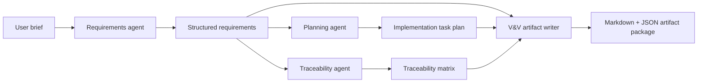

# V-Model Agentic Development Engine

An open-source MVP for an agentic software development system that turns high-level software requirements into inspectable V-model lifecycle artifacts.

This first vertical slice is deterministic and local-first:

- Accept a plain-text requirements brief.
- Generate structured user needs, system requirements, and software requirements.
- Create an initial project plan.
- Create a requirements traceability matrix.
- Produce starter V&V artifacts in Markdown and JSON.

The architecture is designed so LLM agents and developer tools can be added behind stable interfaces without making quality gates nondeterministic.

## Quick Start

```powershell
python -m venv .venv
.\.venv\Scripts\Activate.ps1
pip install -e .[dev]
vmodel-engine init examples\sample_requirements.txt --output runs\sample
vmodel-engine build examples\sample_requirements.txt --output runs\first-project --project-name "First Project"
pytest
```

## MVP Architecture

The engine is organized around an artifact pipeline:

1. `Intake` reads a user requirements brief.
2. `RequirementsAgent` converts the brief into structured needs and requirements.
3. `PlanningAgent` derives implementation tasks.
4. `TraceabilityAgent` links requirements to design placeholders, tasks, tests, and verification status.
5. `ArtifactWriter` emits Markdown and JSON artifacts.

Future versions should replace or augment deterministic agents with orchestrated agents while keeping artifact schemas and gate checks stable.



## Target Architecture

The long-term system should integrate:

- Work item source of truth: GitHub Issues or Jira.
- Implementation workers: OpenHands and/or SWE-agent.
- Agent orchestration: LangGraph or CrewAI.
- SCM and review: Git branches, pull requests, protected branch rules.
- Deterministic gates: pytest, Jest, Playwright, Semgrep, Trivy, CI status checks.
- Observability: OpenTelemetry and Langfuse-compatible traces.

Agents may propose and execute work, but release gates should depend on reproducible tools and recorded evidence.

## Repository Layout

```text
vmodel_engine/          Core package
schemas/                JSON Schema definitions for artifacts
docs/                   MVP architecture and implementation plan
examples/               Sample requirements input
tests/                  Unit tests for the vertical slice
```

## Current Scope

This MVP now generates a small Python CLI project, local issue-style work items, gate results, and release evidence. External issue trackers, hosted CI, pull requests, and coding-agent workers are represented by adapters and planned integration points.

## Accepting A First Project

Create a text file containing bullet-point requirements, then run:

```powershell
vmodel-engine build path\to\requirements.txt --output runs\my-project --project-name "My Project"
```

The engine currently supports `python-cli` projects.

## GitHub Project

The default GitHub Project target is configured in `config/github.json`.

```powershell
vmodel-engine github status
```

PlantSpeak is configured as the first project test target. See `docs/plantspeak-first-project.md`.

## Agent Governance

The engine includes a Software Lead Agent role, specialist review roles, three-review minimums for design artifacts, arbitration records for dev/test disputes, and quality policy gates. See `docs/agent-governance.md`.

## GitHub Delivery

The engine can deliver a generated project into a GitHub product repo with artifacts, issues, Project links, implementation branch, PR, and CI.

```powershell
vmodel-engine deliver examples\plantspeak_requirements.txt --repo johns-code/plantspeak --output runs\plantspeak-delivery --project-name "PlantSpeak"
```

See `docs/github-delivery.md`.

## Dashboard

Run a local dashboard for any workflow output directory:

```powershell
vmodel-engine dashboard runs\plantspeak-dashboard --port 8766
```

The dashboard shows V-model progress, artifacts, work items or GitHub issues, gates, agent reviews, arbitration records, and a clarification queue for the Software Lead Agent.

See `docs/dashboard.md`.
